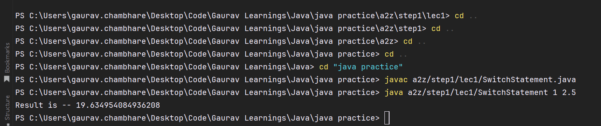

As seen in above image for running the files where an argument from a user is being required while running of the 
program, you will need to run it from command line

---

The error you encountered was not related to the presence of the Java SDK in the directory but rather to the package structure and the way Java resolves class paths.

Here’s a breakdown of what happened:

1. **Package Structure**: Your `SwitchStatement.java` file is part of a package (e.g., `a2z.step1.lec1`). When you compile a Java file that belongs to a package, the compiled `.class` file is placed in a directory structure that matches the package name.

2. **Compilation**:
    - When you compile the file with `javac a2z/step1/lec1/SwitchStatement.java`, the compiler generates the `SwitchStatement.class` file inside the `a2z/step1/lec1` directory, following the package structure.

3. **Running the Program**:
    - When you run the compiled class, you need to specify the fully qualified class name (including the package) and ensure you are in the root directory of the package structure.
    - Running `java a2z.step1.lec1.SwitchStatement` from the root directory (`C:\Users\gaurav.chambhare\Desktop\Code\Gaurav Learnings\Java\java practice`) works because the Java runtime can locate the class file within the package structure.

### Key Points:

- **Java SDK Location**: The Java SDK (JDK) needs to be installed and properly configured in your system's PATH, but it doesn't need to be in the specific directory where you run `javac` or `java` commands. The JDK tools (like `javac` and `java`) should be globally accessible via your PATH environment variable.
- **Directory Structure**: Ensure you are in the correct directory when running the `javac` and `java` commands. For compilation, you can be in any directory as long as you specify the correct path to the source file. For execution, you need to be in the directory that corresponds to the root of your package structure.

### Example of Correct Setup:

1. **Directory Structure**:
   ```
   your_project_directory/
   └── a2z/
       └── step1/
           └── lec1/
               ├── SwitchStatement.java
               └── SwitchStatement.class
   ```

2. **Compilation**:
   ```sh
   javac a2z/step1/lec1/SwitchStatement.java
   ```

3. **Execution**:
   ```sh
   java a2z.step1.lec1.SwitchStatement 1 5
   ```

### Conclusion:
The error was due to not being in the root directory of your package structure when running the `java` command.
Once you navigated to the correct directory 
(`C:\Users\gaurav.chambhare\Desktop\Code\Gaurav Learnings\Java\java practice`), the Java runtime could locate and run
your class file successfully.