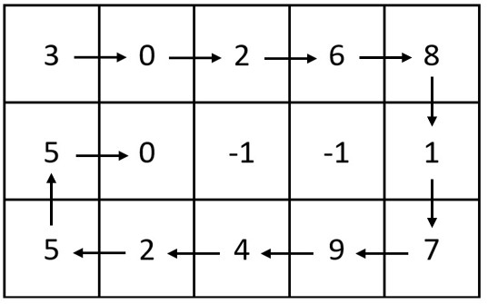

**Question**
Write a function to generate an \( n \times n \) matrix filled with numbers from \( 1 \) to \( n^2 \) in a spiral order, starting from the top-left corner and proceeding in the following order: right, down, left, and up, until the entire matrix is filled.

*[Spiral matrix II](APSS problems/spiral_matrix_2.java)*

### **Example:**
For \( n = 5 \), the output matrix should be:
```text
[1, 2, 3, 4, 5]
[16, 17, 18, 19, 6]
[15, 24, 25, 20, 7]
[14, 23, 22, 21, 8]
[13, 12, 11, 10, 9]
```

---

### **Intuition**
The key to solving this problem is simulating the process of filling the matrix in a spiral order. Start by initializing an empty \( n \times n \) matrix and define boundaries for the top, bottom, left, and right edges of the matrix. Use a loop to fill numbers from \( 1 \) to \( n^2 \), updating the matrix while respecting the current direction of traversal (right, down, left, or up). Adjust the boundaries after completing each layer of the spiral.

### **Key Steps:**
1. **Initialize the Matrix**: Create an \( n \times n \) matrix filled with zeros.
2. **Define Boundaries**: Use variables `top`, `bottom`, `left`, and `right` to keep track of the current layer of the spiral.
3. **Simulate Spiral Filling**:
   - Traverse the top row (left to right), then increment `top`.
   - Traverse the right column (top to bottom), then decrement `right`.
   - Traverse the bottom row (right to left), then decrement `bottom`.
   - Traverse the left column (bottom to top), then increment `left`.
4. **Stop Condition**: Continue filling until all numbers from \( 1 \) to \( n^2 \) are placed.

---

### **Code Implementation (Java)**
```java
import java.util.Arrays;

public class SpiralMatrix {
    public static int[][] generateMatrix(int n) {
        int[][] matrix = new int[n][n];
        int top = 0, bottom = n - 1, left = 0, right = n - 1;
        int num = 1;

        while (num <= n * n) {
            for (int j = left; j <= right; j++) {
                matrix[top][j] = num++;
            }
            top++;

            for (int i = top; i <= bottom; i++) {
                matrix[i][right] = num++;
            }
            right--;

            for (int j = right; j >= left; j--) {
                matrix[bottom][j] = num++;
            }
            bottom--;

            for (int i = bottom; i >= top; i--) {
                matrix[i][left] = num++;
            }
            left++;
        }
        return matrix;
    }

    public static void main(String[] args) {
        int n = 5;
        int[][] result = generateMatrix(n);
        for (int[] row : result) {
            System.out.println(Arrays.toString(row));
        }
    }
}
```

---

### **Explanation of Code**
1. **Matrix Initialization**: The matrix is initialized with zeros using a 2D array.
2. **Boundary Updates**: Each boundary (`top`, `bottom`, `left`, `right`) is adjusted after filling the corresponding row or column.
3. **Direction Control**: The traversal order is strictly maintained (right, down, left, up).
4. **Stop Condition**: The loop terminates once all numbers from \( 1 \) to \( n^2 \) are filled.

---

### **Complexity Analysis**
- **Time Complexity**: \( O(n^2) \) since each cell is visited once.
- **Space Complexity**: \( O(1) \) as we modify the matrix in place.

=================================

---

### **Reattempt this problem**
[Spiral Matrix](https://leetcode.com/problems/spiral-matrix/)

=================================

[Spiral Matrix III](https://leetcode.com/problems/spiral-matrix-iii)

Return an array of coordinates representing the positions of the grid in the order you visited them.

### **Code Implementation (Java)**
```java
import java.util.ArrayList;
import java.util.List;

public class SpiralMatrixIII {
    public static List<int[]> spiralMatrixIII(int rows, int cols, int rStart, int cStart) {
        int[][] directions = {{0, 1}, {1, 0}, {0, -1}, {-1, 0}}; // Right, Down, Left, Up
        List<int[]> result = new ArrayList<>();
        result.add(new int[]{rStart, cStart});
        int totalCells = rows * cols;
        int steps = 0;
        int directionIndex = 0;
        
        while (result.size() < totalCells) {
            if (directionIndex % 2 == 0) {
                steps++;
            }
            
            for (int i = 0; i < steps; i++) {
                rStart += directions[directionIndex][0];
                cStart += directions[directionIndex][1];
                
                if (rStart >= 0 && rStart < rows && cStart >= 0 && cStart < cols) {
                    result.add(new int[]{rStart, cStart});
                }
            }
            directionIndex = (directionIndex + 1) % 4;
        }
        return result;
    }

    public static void main(String[] args) {
        List<int[]> result = spiralMatrixIII(5, 6, 1, 4);
        for (int[] pos : result) {
            System.out.println("[" + pos[0] + ", " + pos[1] + "]");
        }
    }
}
```

### **Complexity Analysis**
- **Time Complexity**: \( O(rows \times cols) \) since every valid cell is visited once.
- **Space Complexity**: \( O(rows \times cols) \) since the result stores all matrix positions.

---

### **Conclusion**
- **The iterative approach ensures efficient traversal while maintaining the expected spiral order.** 🚀
===========================

[Spiral Matrix](https://leetcode.com/problems/spiral-matrix)

### **Optimized Solution**
We can simplify and optimize the solution as follows:

```java
import java.util.*;

class Solution {
    public List<Integer> spiralOrder(int[][] matrix) {
        List<Integer> res = new ArrayList<>();
        if (matrix == null || matrix.length == 0) return res;

        int top = 0, bottom = matrix.length - 1, left = 0, right = matrix[0].length - 1;

        while (top <= bottom && left <= right) {
            // Traverse from left to right along the top row
            for (int j = left; j <= right; j++) {
                res.add(matrix[top][j]);
            }
            top++;

            // Traverse from top to bottom along the right column
            for (int i = top; i <= bottom; i++) {
                res.add(matrix[i][right]);
            }
            right--;

            // Traverse from right to left along the bottom row (if not already processed)
            if (top <= bottom) {
                for (int j = right; j >= left; j--) {
                    res.add(matrix[bottom][j]);
                }
                bottom--;
            }

            // Traverse from bottom to top along the left column (if not already processed)
            if (left <= right) {
                for (int i = bottom; i >= top; i--) {
                    res.add(matrix[i][left]);
                }
                left++;
            }
        }
        return res;
    }
}
```

### **Explanation of the Optimized Code**
1. **Boundary Conditions**:
   - `top`, `bottom`, `left`, and `right` define the boundaries of the unprocessed portion of the matrix.
   - After processing a row or column, the respective boundary is updated to shrink the unprocessed area.

2. **Conditions for Traversal**:
   - The checks `if (top <= bottom)` and `if (left <= right)` ensure that rows or columns are processed only if they haven't been visited already.

3. **Termination**:
   - The loop runs as long as there are rows or columns left to process (`top <= bottom` and `left <= right`).

### **Time Complexity**
- **O(m * n)**: Each element of the matrix is visited exactly once.
  
### **Space Complexity**
- **O(1)**: Aside from the result list, no extra space is used.

---

### **Input/Output Examples**

#### Example 1:
```java
int[][] matrix = {{1, 2, 3, 4}, {5, 6, 7, 8}, {9, 10, 11, 12}};
Solution sol = new Solution();
System.out.println(sol.spiralOrder(matrix));
// Output: [1, 2, 3, 4, 8, 12, 11, 10, 9, 5, 6, 7]
```

#### Example 2:
```java
int[][] matrix = {{1}};
Solution sol = new Solution();
System.out.println(sol.spiralOrder(matrix));
// Output: [1]
```

===========================

[Spiral Matrix IV](C:\Users\gchamb02\Desktop\Gaurav Learnings\java\DSA_java\APSS problems\spiral_matrix_4.java)

You are given two integers `m` and `n`, which represent the dimensions of a matrix.
You are also given the head of a linked list of integers.
Generate an `m x n` matrix that contains the integers in the linked list presented in spiral order (clockwise), starting from the top-left of the matrix. If there are remaining empty spaces, fill them with `-1`.
Return the generated matrix.



```java
class ListNode {
    int val;
    ListNode next;
    ListNode(int val) {
        this.val = val;
        this.next = null;
    }
}

import java.util.*;

class Solution {
    public int[][] spiralMatrix(int m, int n, ListNode head) {
        int left = 0, right = n, top = 0, bottom = m;
        int[][] res = new int[m][n];
        
        // Initialize matrix with -1
        for (int[] row : res) {
            Arrays.fill(row, -1);
        }
        
        while (head != null) {
            for (int col = left; col < right; col++) {
                if (head == null) return res;
                res[top][col] = head.val;
                head = head.next;
            }
            top++;
            
            for (int row = top; row < bottom; row++) {
                if (head == null) return res;
                res[row][right - 1] = head.val;
                head = head.next;
            }
            right--;
            
            if (left < right) {
                for (int col = right - 1; col >= left; col--) {
                    if (head == null) return res;
                    res[bottom - 1][col] = head.val;
                    head = head.next;
                }
                bottom--;
            }
            
            if (top < bottom) {
                for (int row = bottom - 1; row >= top; row--) {
                    if (head == null) return res;
                    res[row][left] = head.val;
                    head = head.next;
                }
                left++;
            }
        }
        return res;
    }
}
```

===========================

[Efficient Range Sum Queries Using Prefix Sums](C:\Users\gchamb02\Desktop\Gaurav Learnings\java\DSA_java\APSS problems\AccumulatorVariables.java)

#### **Optimized Solution**
We can simplify and optimize the solution as follows:

```java
import java.util.*;

class PrefixSum {
    /**
     * Compute the prefix sums array.
     */
    public static int[] computePrefixSum(int[] arr) {
        int[] prefixSum = new int[arr.length];
        prefixSum[0] = arr[0];
        for (int i = 1; i < arr.length; i++) {
            prefixSum[i] = prefixSum[i - 1] + arr[i];
        }
        return prefixSum;
    }

    /**
     * Compute the sum of elements from index i to j using the prefix sums array.
     */
    public static int rangeSumQuery(int i, int j, int[] prefixSum) {
        if (i < 0 || j >= prefixSum.length || i > j) {
            System.out.println("Invalid indices!");
            return 0;
        }
        return (i == 0) ? prefixSum[j] : prefixSum[j] - prefixSum[i - 1];
    }

    public static void main(String[] args) {
        int[][] testCases = {
            {1, 2},
            {2, 4, 0, 0, 0, 0},
            {4, 5, 1, 81, 0, 8, 47, 100, 4, 7},
            {1, 2, 1, 54, 4}
        };
        
        for (int[] testCase : testCases) {
            if (testCase.length < 3) {
                System.out.println("Empty input array!");
                continue;
            }
            int i = testCase[0], j = testCase[1];
            int[] arr = Arrays.copyOfRange(testCase, 2, testCase.length);
            int[] prefixSum = computePrefixSum(arr);
            int result = rangeSumQuery(i, j, prefixSum);
            System.out.println("Sum from index " + i + " to " + j + ": " + result);
        }
    }
}
```

### **Explanation of the Optimized Code**
1. **Function `computePrefixSum`**:
   - Computes the prefix sum array, where `prefixSum[i]` stores the sum of all elements from index `0` to `i`.
   - Runs in **O(n)** time.

2. **Function `rangeSumQuery`**:
   - Uses the prefix sum array to get the sum of elements between indices `i` and `j` in **O(1)** time.
   - Handles edge cases such as invalid indices.

### **Time Complexity**
- **O(n)**: The `computePrefixSum` function runs in linear time.
- **O(1)**: The `rangeSumQuery` function runs in constant time.

### **Space Complexity**
- **O(n)**: The prefix sums array requires additional space proportional to the input array.

===========================

### [Reverse a String Using Recursion](C:\Users\gchamb02\Desktop\Gaurav Learnings\java\DSA_java\APSS problems\ReverseString.java)

### Problem Statement
Reverse a given string by recursively swapping characters from the ends towards the center.

---

### Approach 1: Reverse Without Slicing

### Explanation
This approach uses two indices (`start` and `end`) to swap characters in the string until the indices meet or cross. A `char[]` array is used to perform swaps since strings in Java are immutable. The reversed string is then constructed from the character array.

### Code
```java
class ReverseString {
    public static String reverseStringRecursiveNoSlicing(char[] str, int start, int end) {
        if (start >= end) {
            return new String(str);
        }
        // Swap characters
        char temp = str[start];
        str[start] = str[end];
        str[end] = temp;
        
        // Recursive call
        return reverseStringRecursiveNoSlicing(str, start + 1, end - 1);
    }
    
    public static void main(String[] args) {
        String input = "abcdef";
        String result = reverseStringRecursiveNoSlicing(input.toCharArray(), 0, input.length() - 1);
        System.out.println("Reversed: " + result);
    }
}
```

---

### Approach 2: Reverse Using Recursion (with String Slicing)

### Explanation
This approach recursively moves the last character to the front and reverses the rest of the string.

### Code
```java
class ReverseString {
    public static String reverseStringRecursive(String input) {
        if (input.length() <= 1) {
            return input;
        }
        return input.charAt(input.length() - 1) + reverseStringRecursive(input.substring(0, input.length() - 1));
    }
    
    public static void main(String[] args) {
        String input = "abcdef";
        String result = reverseStringRecursive(input);
        System.out.println("Reversed: " + result);
    }
}
```

---

### Comparison of Approaches
| **Aspect**                 | **Without Slicing**                        | **With Slicing**                |
|----------------------------|--------------------------------------------|---------------------------------|
| **Time Complexity**        | \(O(n)\)                                  | \(O(n^2)\) (due to slicing)     |
| **Space Complexity**       | \(O(n)\) (for `char[]` array)             | \(O(n)\) (call stack and slices)|
| **Efficiency**             | Faster for large strings                  | Slower for large strings        |
| **Mutability**             | Uses `char[]` to modify string             | Works with immutable `String`   |

---
