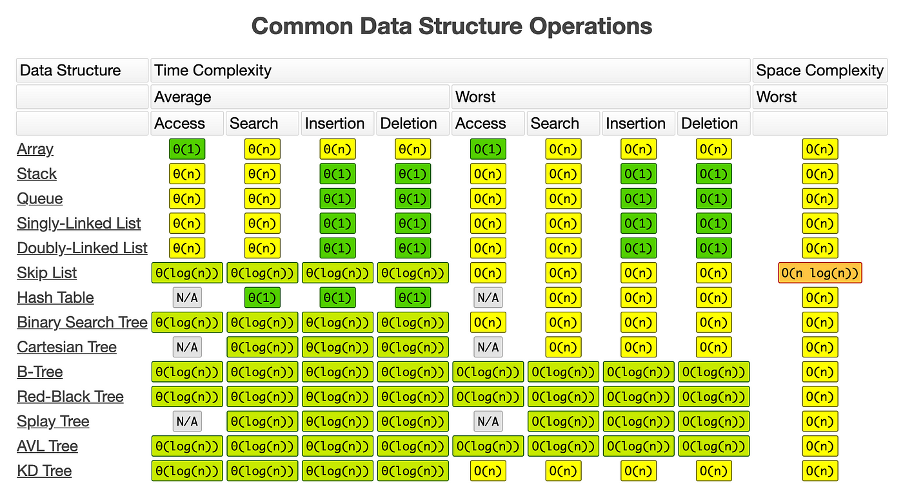
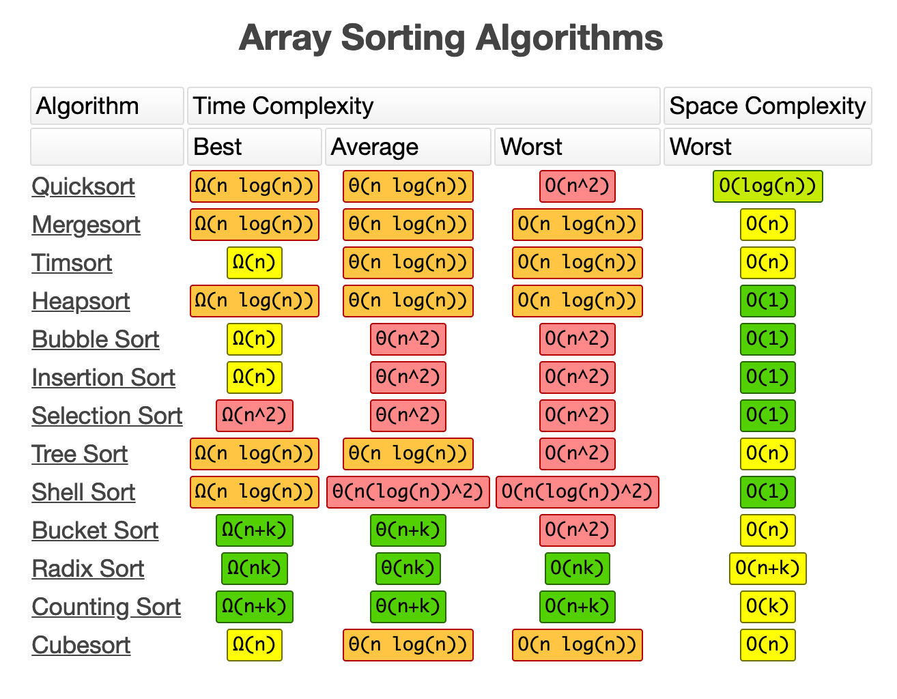
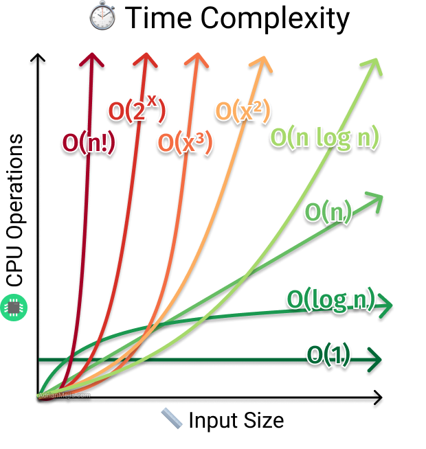

---


---



*1. Striver_a2z_sheet/step1/lec2/pattern11.java*
pattern 
```text
1
0 1
1 0 1
```
**Intuition**: Use two loops—outer for rows and inner for alternating binary values. Determine the starting value for each row (`1` for odd, `0` for even) and toggle using XOR (`start ^= 1`).

```java
public class Pattern11 {
    public static void main(String[] args) {
        int n = 4;
        for (int i = 1; i <= n; i++) {
            int start = i % 2;
            for (int j = 0; j < i; j++) {
                System.out.print(start + " ");
                start ^= 1;
            }
            System.out.println();
        }
    }
}
```
===========================

---
*2. Striver_a2z_sheet/step1/lec2/pattern12.java*
```text
1         1
1 2     2 1
1 2 3 3 2 1
```
The pattern can be broken into three parts for each row:
- Left Part: Numbers increment from 1 to the row number (i).
- Spaces: Decreasing spaces between the left and right parts, calculated dynamically based on the row.
- Right Part: Numbers decrement from the row number (i) to 1.
```java
public class Pattern12 {
    public static void main(String[] args) {
        int n = 4;
        for (int i = 1; i <= n; i++) {
            for (int j = 1; j <= i; j++) {
                System.out.print(j + " ");
            }
            for (int k = 0; k < 2 * (n - i); k++) {
                System.out.print("  ");
            }
            for (int l = i; l >= 1; l--) {
                System.out.print(l + " ");
            }
            System.out.println();
        }
    }
}
```
===========================

---

*3. Striver_a2z_sheet/step1/lec2/pattern14.java*

```text
A
A B
A B C
```

 **Intuition**: In Java, use typecasting to convert ASCII values to characters.

```java
public class Pattern14 {
    public static void main(String[] args) {
        int n = 3;
        for (int i = 1; i <= n; i++) {
            char val = 'A';
            for (int j = 1; j <= i; j++) {
                System.out.print(val + " ");
                val = (char) (val + 1);
            }
            System.out.println();
        }
    }
}
```
===========================

---

*4. Striver_a2z_sheet/step1/lec2/pattern22.java*
```text
4444444
4333334
4322234
4321234
4322234
4333334
4444444
```
```java
public class Pattern22 {
    public static void main(String[] args) {
        int n = 4;
        for (int row = 0; row < 2 * n - 1; row++) {
            for (int col = 0; col < 2 * n - 1; col++) {
                int left = col;
                int right = 2 * n - 2 - col;
                int top = row;
                int bottom = 2 * n - 2 - row;
                int val = n - Math.min(Math.min(left, right), Math.min(top, bottom));
                System.out.print(val);
            }
            System.out.println();
        }
    }
}
```
===========================

---

*5. Striver_a2z_sheet/step1/lec4/gcd_lcm.java*
```java
public class GCD_LCM {
    public static int gcd(int a, int b) {
        return (b == 0) ? a : gcd(b, a % b);
    }

    public static int lcm(int a, int b) {
        return (a * b) / gcd(a, b);
    }

    public static void main(String[] args) {
        int a = 12, b = 15;
        System.out.println("GCD: " + gcd(a, b));
        System.out.println("LCM: " + lcm(a, b));
    }
}
```
===========================

---

*6. Striver_a2z_sheet/step1/lec5/reverse_array.java*
```java
import java.util.Arrays;
public class ReverseArray {
    public static void reverse(int[] arr, int left, int right) {
        if (left >= right) return;
        int temp = arr[left];
        arr[left] = arr[right];
        arr[right] = temp;
        reverse(arr, left + 1, right - 1);
    }

    public static void main(String[] args) {
        int[] arr = {1, 2, 3, 4, 5};
        reverse(arr, 0, arr.length - 1);
        System.out.println(Arrays.toString(arr));
    }
}
```
===========================

---

*7. Striver_a2z_sheet/step1/lec5/fibonacci_number.java*
```java
public class Fibonacci {
    public static int fib(int n) {
        if (n <= 1) return n;
        return fib(n - 1) + fib(n - 2);
    }

    public static void main(String[] args) {
        int n = 10;
        System.out.println("Fibonacci(" + n + ") = " + fib(n));
    }
}
```
===========================

---
*8. src/main/java/a2z/step1/lec4/CheckArmstrong.java*
```java
public class CheckArmstrong {
    public static void main(String[] args) {
        Scanner sc = new Scanner(System.in);
        int n = sc.nextInt();
        int power = String.valueOf(n).length();
        int copy = n;
        int sum = 0;
        while(copy > 0){
            sum = (int) (sum + Math.pow((copy % 10), power));
            copy /= 10;
        }
        System.out.println(sum == n);
        sc.close();
    }
}
```
Step-by-Step Execution
1. Extract the last digit of copy using `copy % 10`.
2. Raise the digit to the given power using `Math.pow(digit, power)`.
3. Add the result to sum.
4. Remove the last digit from `copy` by performing integer division `copy /= 10`.
5. Repeat the process until `copy` becomes 0.

===========================

---
*9. src/main/java/a2z/step1/lec4/FibonacciNumber.java*
```java
public class FibonacciNumber {
    public static int fib(int n) {
        if(n==1){
            return 1;
        }
        else if(n==0){
            return 0;
        }

        return fib(n-1) + fib(n-2);
    }
//    Iterative approach -- more optimised
    public static int fibiter(int N)
    {
        if(N <= 1)
            return N;

        int a = 0, b = 1;

        while(N-- > 1)
        {
            int sum = a + b;
            a = b;
            b = sum;
        }
        return b;
    }
    public static void main(String[] args) {
        Scanner sc = new Scanner(System.in);
        int n = sc.nextInt();
        System.out.println(fibiter(n));
        sc.close();
    }
}
```


### **Comparison of Recursive vs Iterative Fibonacci Methods**

| Approach      | Time Complexity | Space Complexity | Pros | Cons |
|--------------|---------------|----------------|------|------|
| **Recursive (`fib`)** | **O(2ⁿ) (Exponential)** | **O(n) (Stack space for recursion calls)** | Simple, follows the mathematical definition | Very slow for large `n`, causes stack overflow |
| **Iterative (`fibiter`)** | **O(n) (Linear)** | **O(1) (Constant, no extra space)** | Efficient, avoids recursion overhead | Slightly more code, but very fast |

===========================

---
*10. src/main/java/a2z/step1/lec4/Frequencies_of_limited_range_array_elements.java*

### **Problem Statement**
Given an array `arr[]` of size `N` and an integer `P` representing the maximum range value, count the frequency of each number from `1` to `P` in the array. Modify the array in-place to store the frequency of each number in its corresponding index.

In Java, when you create an integer array using new int[size], all elements are automatically initialized to 0 by default.

### **Example 1**
#### **Input:**
```text
N = 5, P = 5
arr = [2, 3, 2, 3, 5]
```
#### **Output:**
```text
0 2 2 0 1
```
#### **Explanation:**
- The frequency of `1` is `0`.
- The frequency of `2` is `2`.
- The frequency of `3` is `2`.
- The frequency of `4` is `0`.
- The frequency of `5` is `1`.

---

## **Approach (Optimized In-Place Counting)**
### **Logic Explanation**
- The idea is to use **indexing** to store the frequencies within the array itself.
- Instead of using an extra frequency array, we manipulate the given array to track frequencies efficiently.
- **Negative values** are used as markers to indicate that an element's frequency is being counted.

### **Algorithm**
1. **First Pass (Rearrange Elements)**
   - Iterate through the array.
   - If the element is **out of range** (i.e., not between `1` and `P`), ignore it.
   - Otherwise, compute its correct index (`arr[i] - 1`).
   - If the indexed position is still **positive**, swap values.
   - If already processed (negative marker), decrement its count.
   - Mark visited positions with `-1` to track counts.
2. **Second Pass (Adjust the Counts)**
   - Convert negative values back to positive to get the actual frequency counts.

---

## **Code Implementation**
```java
public class FrequenciesOfLimitedRangeArrayElements {

    public static void frequencyCount(int arr[], int N, int P) {
        int i = 0;
        while (i < N) {
            // Ignore elements that are out of the range [1, P]
            if (arr[i] <= 0 || arr[i] > P) {
                i++;
                continue;
            }

            // Get index corresponding to current element (1-based to 0-based)
            int elementIndex = arr[i] - 1;

            // If element at elementIndex hasn't been processed yet (i.e., positive value)
            if (elementIndex < N && arr[elementIndex] > 0) {
                // Store the current element value and mark the position with -1
                arr[i] = arr[elementIndex];  // Replace with the value at that index
                arr[elementIndex] = -1;  // Mark the element as seen once
            } else if (elementIndex < N) {
                // If already processed, decrement its value (it is stored as negative)
                arr[elementIndex]--;
                // Set current element to 0 as it's now processed
                arr[i] = 0;
                i++;
            } else {
                // Handle elements greater than N
                i++;
            }
        }

        // Second pass to adjust counts
        for (int k = 0; k < N; k++) {
            if (arr[k] < 0)
                arr[k] = -arr[k]; // Convert counts back to positive
            else
                arr[k] = 0; // Set positions where element didn't appear to 0
        }
    }
}
```

---

## **Time Complexity Analysis**
- **First pass:** `O(N)`, since we traverse the array once.
- **Second pass:** `O(N)`, since we again traverse the array once.
- **Total Complexity:** `O(N)`, making it an efficient solution.

## **Space Complexity Analysis**
- We use **O(1)** extra space as we modify the input array in place.

---

## **Edge Cases Considered**
- ✅ All numbers in the array are within range `[1, P]`.
- ✅ Some or all numbers are **out of range**.
- ✅ Duplicate numbers appear multiple times.
- ✅ `N == 1`, smallest input case.
- ✅ `P > N`, ensuring all values fit within the given range.


===========================

---

*11.src/main/java/a2z/step1/lec4/LcmAndGcd.java*

### LCM and GCD Calculation

#### **Problem Statement**
Given two numbers `a` and `b`, compute their **Least Common Multiple (LCM)** and **Greatest Common Divisor (GCD)**.

### **Approach 1: Brute Force (Iterative GCD Calculation)**
### **Logic Explanation**
- Iterate from `min(a, b)` down to `1`.
- The first number that divides both `a` and `b` is the **GCD**.
- Use the formula to compute **LCM**:  
  LCM(a, b) = (a * b)/GCD(a, b)

### **Code Implementation (Java)**
```java
public class LCM_GCD {
    public static int gcd(int a, int b) {
        for (int x = Math.min(a, b); x > 0; x--) {
            if (a % x == 0 && b % x == 0) {
                return x;
            }
        }
        return 1;
    }

    public static int lcm(int a, int b) {
        return (a * b) / gcd(a, b);
    }

    public static void main(String[] args) {
        int a = 12, b = 15;
        System.out.println("LCM: " + lcm(a, b) + ", GCD: " + gcd(a, b));
    }
}
```

### **Time Complexity Analysis**
- **Worst-case:** `O(min(a, b))` iterations.
- Not efficient for large numbers.

---

### **Approach 2: Using Euclidean Algorithm (Efficient Method)**
### **Logic Explanation**
- The **Euclidean algorithm** is based on the property:
  
    GCD(a, b) = GCD(b, a % b)
  
  - Keep replacing `a` with `b` and `b` with `a % b` until `b == 0`.
  - The remaining value of `a` is the **GCD**.
  - Compute **LCM** using the formula:
    
    LCM(a, b) = (a * b)/GCD(a, b)

### **Code Implementation (Java)**
```java
public class LCM_GCD_Efficient {
    public static int gcd(int a, int b) {
        while (b != 0) {
            int temp = b;
            b = a % b;
            a = temp;
        }
        return a;
    }

    public static int lcm(int a, int b) {
        return (a * b) / gcd(a, b);
    }

    public static void main(String[] args) {
        int a = 12, b = 15;
        System.out.println("LCM: " + lcm(a, b) + ", GCD: " + gcd(a, b));
    }
}
```

---

### **Time Complexity Analysis**
- **GCD Calculation (Euclidean Method):** `O(log(min(a, b)))`
- **LCM Calculation:** `O(1)`
- **Overall Complexity:** `O(log(min(a, b)))` (Much faster than brute force!)

---

#### **Edge Cases Considered**
✅ `a == b` → Both GCD and LCM should be `a`.  
✅ One of the numbers is `1` → GCD is `1`, LCM is the larger number.  
✅ Large values of `a` and `b` → Handles efficiently using Euclidean algorithm.  
✅ Prime numbers → GCD is always `1`, LCM is `a * b`.  

===========================

---

*12.src/main/java/a2z/step6/lec1/delete_a_node_in_linked_list.java*

### **Delete Node in a Linked List**  
📌 **Problem Statement:**  
Given a node `node` (not the last node) in a **singly linked list**, delete it without access to `head`.  

### **Approach: Trick to Delete Without Head**
✅ **Key Idea:** Copy the next node’s value into `node` and bypass the next node.  
✅ **Implementation Steps:**  
1. Copy `node.next.val` into `node.val`.  
2. Point `node.next` to `node.next.next`.  
3. Do **not** remove the node from memory (as per the problem constraint).  

### **Code Implementation (Java)**
```java
public class Solution {
    public void deleteNode(ListNode node) {
        node.val = node.next.val;  // Copy next node’s value
        node.next = node.next.next; // Skip the next node
    }
}
```

### **Complexity Analysis**  
- **Time Complexity:** `O(1)` (constant operations)  
- **Space Complexity:** `O(1)` (no extra space)  

---

### **Edge Cases Considered**
✅ `node` is **not** the last node (guaranteed by the problem).  
✅ Works for **any** position except the last.  
✅ **Preserves order** of remaining elements.  

📌 **Trick to Remember:** **Copy & Skip, No Head Needed!** 🚀  

===========================

---
*src/main/java/a2z/step6/lec2/introduction_to_doubly_linked_list.java*

### **Constructing a Doubly Linked List from an Array**  

#### **Problem Statement**  
Given an integer array `arr` of size `n`, construct a **Doubly Linked List (DLL)** where:  
- Each node has `data`, `next` (points to next node), and `prev` (points to previous node).  
- Return the **head** of the doubly linked list.  

---

### **Approach: Iterative Construction**  
✅ Create the **head node** with `arr[0]`.  
✅ Use a `prev` pointer to link nodes **both forward (`next`) and backward (`prev`)**.  
✅ Iterate through `arr` and construct the DLL.  

---

### **Code Implementation (Java)**  
```java
class Node {
    int data;
    Node next, prev;

    Node(int val) {
        data = val;
        next = prev = null;
    }
}

class Solution {
    public Node constructDLL(int[] arr) {
        if (arr.length == 0) return null;
        Node head = new Node(arr[0]), prev = head;

        for (int i = 1; i < arr.length; i++) {
            Node temp = new Node(arr[i]);
            prev.next = temp;
            temp.prev = prev;
            prev = temp;
        }
        return head;
    }
}
```

---

### **Time & Space Complexity**  
- **Time Complexity:** `O(n)` (traverse `arr` once).  
- **Space Complexity:** `O(n)` (create `n` nodes).  

---

### **Key Tricks & Edge Cases**  
✅ **Both forward (`next`) & backward (`prev`) links must be set.**  
✅ **If `arr` is empty, return `null`.**  
✅ **Handles single-element list (no `prev`).**  

📌 **Trick to Remember:**  
- Use `prev.next = temp; temp.prev = prev;` to link nodes both ways! 🚀

===========================

---
*13. src/main/java/a2z/step6/lec2/introduction_to_doubly_linked_list.java*

## **Problem Statement**
- Given a **doubly linked list**, a position `p`, and an integer `x`, insert a new node with value `x` **after the `p`-th node** and return the updated head.
- The index `p` follows **0-based indexing**.
- The doubly linked list has **both `next` and `prev` pointers**.

---

## **Example Walkthrough**

### **Example 1**
#### **Input**:  
```
LinkedList: 2 <-> 4 <-> 5  
p = 2, x = 6
```
#### **Processing**:
- Insert `6` **after** position `p = 2` (which is node `5`).
#### **Output**:  
```
2 <-> 4 <-> 5 <-> 6
```
---

## **Approach**
1. **Traverse to the `p`-th node**:
   - Start from `head` and move `p` times to reach the `p`-th node.
2. **Create a new node** with value `x`.
3. **Insert the new node after the `p`-th node**:
   - Adjust `next` and `prev` pointers to maintain the doubly linked list structure.
4. **Handle edge cases**:
   - If inserting after the last node, set `newNode.next = null`.
   - If inserting between two nodes, update the `prev` pointer of the next node.

---

## **Code Implementation (Java)**
```java
class Solution {
    // Function to insert a new node at given position in doubly linked list.
    Node addNode(Node head, int p, int x) {
        Node temp = head;
        
        // Traverse to the p-th node
        for (int i = 0; i < p; i++) {
            if (temp == null) return head; // Handle invalid p (shouldn't happen as per constraints)
            temp = temp.next;
        }
        
        // Create new node
        Node newNode = new Node(x);
        
        // Insert newNode after temp
        newNode.next = temp.next;
        newNode.prev = temp;
        temp.next = newNode;

        // If newNode is not the last node, update the next node's prev pointer
        if (newNode.next != null) {
            newNode.next.prev = newNode;
        }

        return head;
    }
}
```

---

## **Complexity Analysis**
✅ **Time Complexity:** `O(p)` (since we traverse `p` nodes before insertion).  
✅ **Space Complexity:** `O(1)` (only one new node is created).  

---

## **Edge Cases Considered**
🔹 **`p == 0` (Insert after head)** → Works fine without special handling.  
🔹 **`p` is at the last node** → Correctly assigns `null` to `newNode.next`.  
🔹 **General insert in between** → Both `next` and `prev` pointers are properly set.  

---
